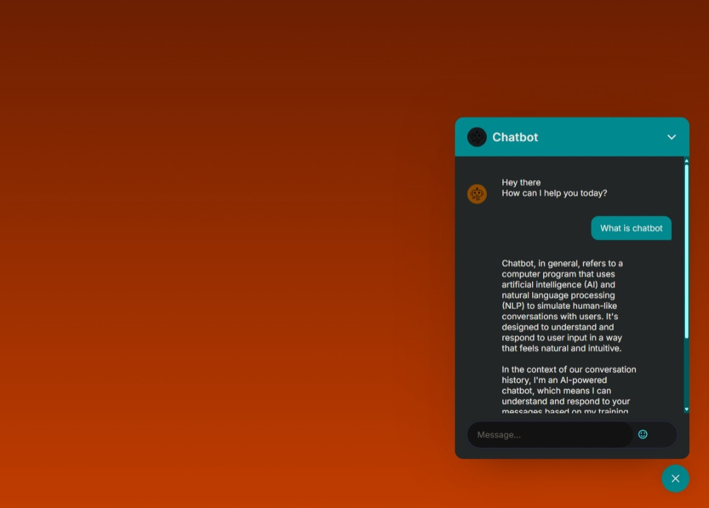

# AI Chatbot Using Ollama Modal

## Project Overview
This project implements an AI-powered chatbot using the Ollama model "llama3.2:1b." The chatbot features a modern and responsive UI built with Flask, HTML, CSS, and JavaScript.

## Project Structure
```
/chatbot_using_ollama
│
├── main.py                # Main Flask application
├── requirement.txt        # Project dependencies
├── static/                # Static files (CSS, JavaScript, images)
│   ├── style.css          # Styles for the chatbot UI
│   └── script.js          # JavaScript for chatbot functionality
│
├── templates/             # HTML templates
│   └── index.html         # Chatbot interface
│
└── screenshot/            # Screenshots of the application
    └── Screenshot_5-2-2025_14145_127.0.0.1.jpeg
```

## Backend Technology
- **Flask:** A lightweight WSGI web application framework in Python.

## Ollama Model Installation
To install the "llama3.2:1b" model, follow these steps:
1. Ensure you have Ollama installed on your local machine.
2. Run the following command to pull the model:
   ```
   ollama pull llama3.2:1b
   ```

## Running the Project Locally
1. Clone the repository to your local machine.
2. Navigate to the project directory.
3. Install the required dependencies:
   ```
   pip install -r requirement.txt
   ```
4. Run the Flask application:
   ```
   python main.py
   ```
5. Open your web browser and navigate to `http://127.0.0.1:5000` to access the chatbot.

## Screenshots

